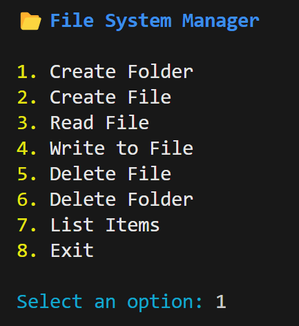
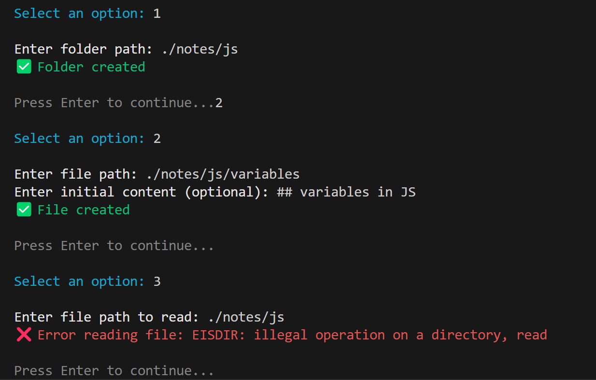
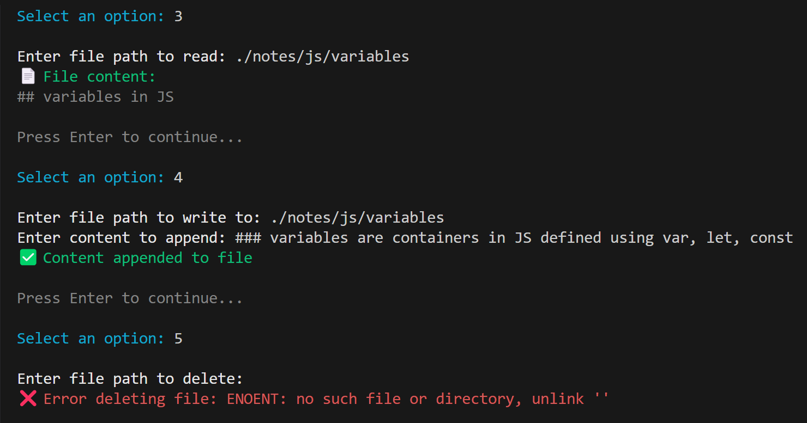
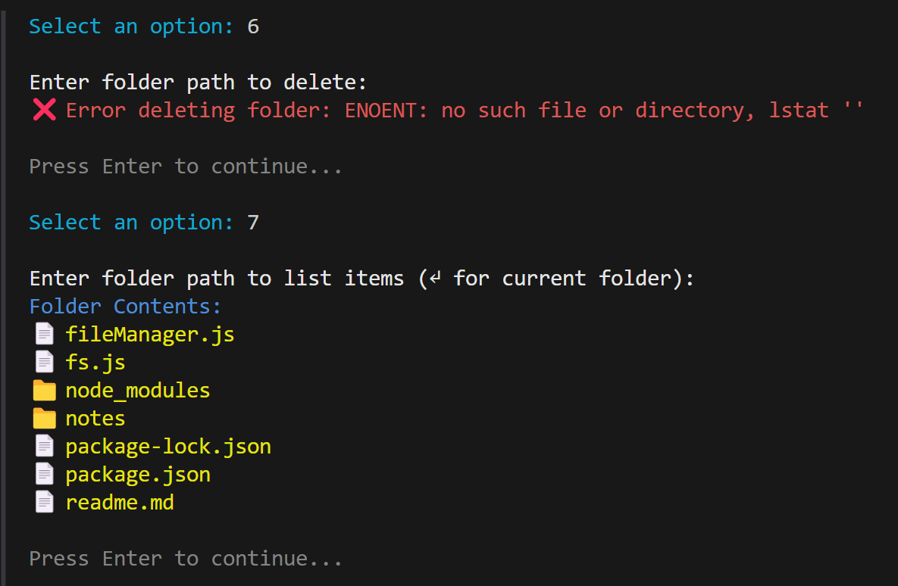
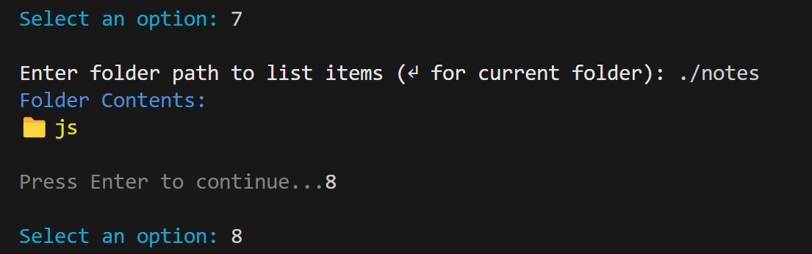

# 📂 Node.js File Manager CLI

A simple and interactive command-line application built with Node.js for managing files and folders directly from your terminal.

---

## 🛠 Features

- **Create Folder**
- **Create File** 
- **Read File**
- **Write(append) to File**
- **Delete File**
- **Delete Folder**
- **List Items**
- **Exit CLI**

---

## 🚀 Getting Started

### 1. Clone the Repository

```bash
git clone https://github.com/sriimalya/node-file-manager
cd repo-name
```

### 2. Install Dependencies

```bash
npm install
```

### 3. Run the Application

```bash
node fileManager.js
```

---

## 📸 Screenshots

Below are screenshots of all available options in the CLI:





